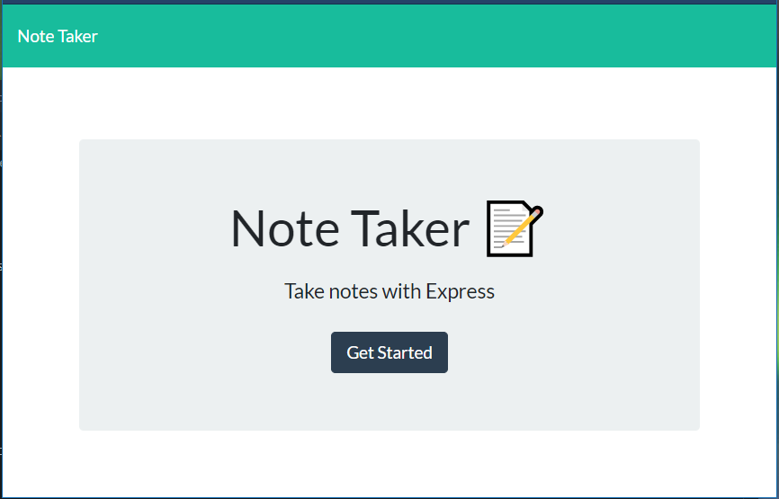
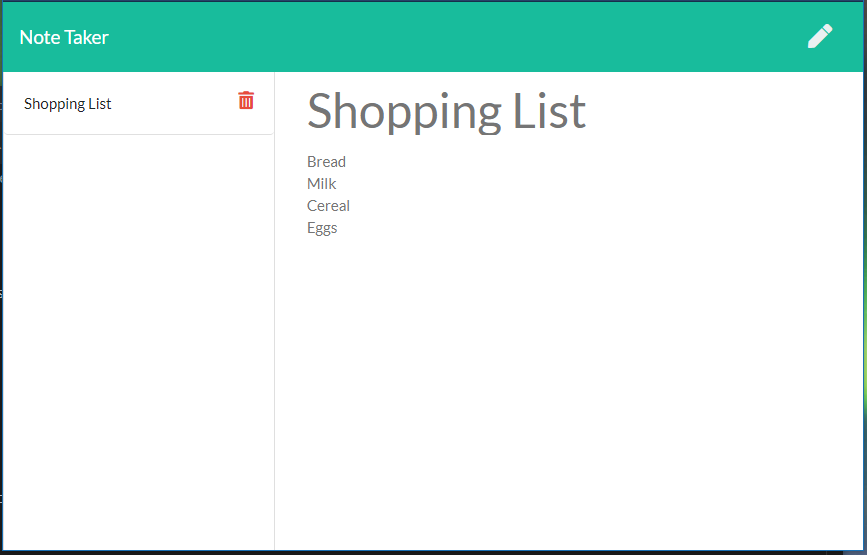

# Express Note Taker

Deployed app: https://dry-thicket-72936.herokuapp.com/

## Table of contents
* [Description](#description)
* [Installation](#installation)
* [Tests](#tests)
* [Questions](#questions)

## Description
A note taker application that uses an express backend server that saves and retrieves data from a JSON file. The application allows the user to save new notes, view existing notes, and delete notes.

The user first sees the homepage of the application, 


then has the option to "Get Started", which brings them to a page to create a new note.


Existing notes appear on the left column and the user has the option to delete.

        
## Installation
To install necessary dependencies, run the following command:
```
npm i
```

## Questions
If you have any questions about this repository, open an issue or contact me directly at megtej@gmail.com. You can find more of my work at [mslee001](https://github.com/mslee001).